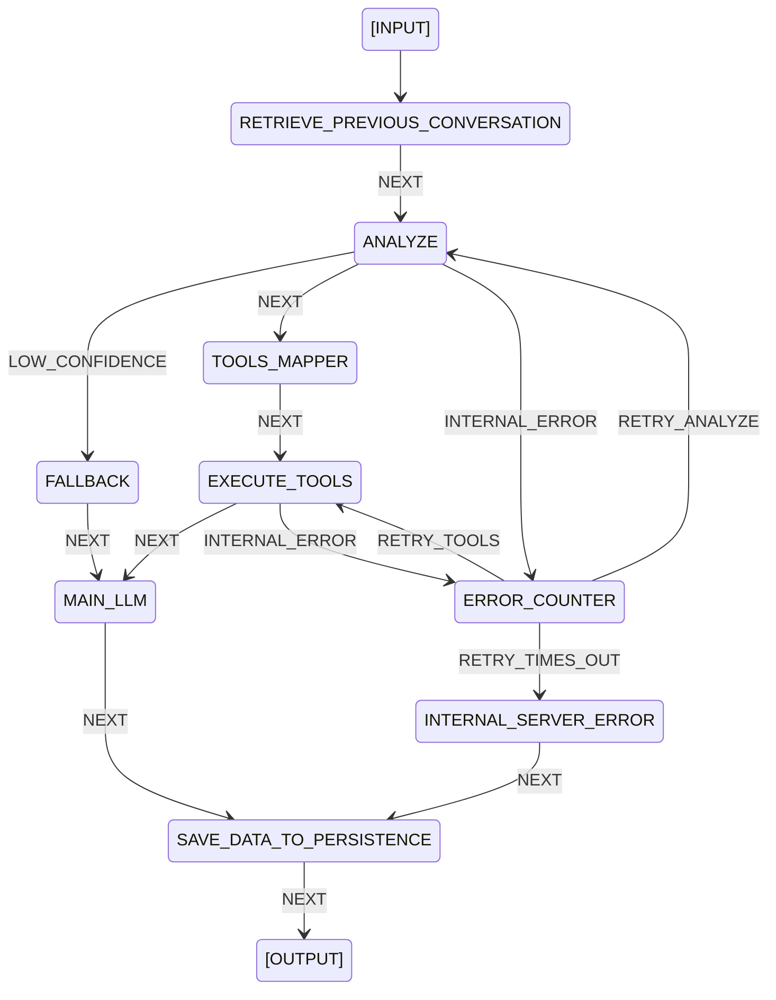

# AI Pipeline Runtime

A code-based AI orchestrator built on Deterministic Finite Automaton (DFA) principles.
Gives you full control over your AI pipeline — routing, error handling, and decision making
are defined in code, not in prompts.

---

## Philosophy

Most AI frameworks delegate routing and decision making to LLMs automatically.
This runtime takes the opposite approach:

- **Deterministic skeleton** — flow, routing, and error handling are explicit and predictable
- **Probabilistic flesh** — LLMs are only used where reasoning is genuinely needed
- **Schema-driven** — pipeline behavior is defined in a JSON schema, not hardcoded
- **Batteries included, but replaceable** — comes with a ready-to-use pipeline, every part is open for customization

---

## Requirements

- Python 3.10+
- pydantic

Infrastructure dependencies (Redis, database, LLM) are entirely up to your implementation.
The runtime only defines the interfaces.

---

## How It Works

The runtime executes a pipeline defined in `schema.json`. Each state in the schema maps
to an executor function that you register. The runtime loops through states, calls the
executor, reads the returned event, and transitions to the next state.

```
Input → State A → executor_a() → event → State B → executor_b() → event → ... → Final
```

---

## Project Structure

```
project/
├── jsonSchema/
│   ├── schema.json          # FSM pipeline definition
│   └── tools_schema.json    # Tool mapping and priority
├── plugins/
│   ├── base/                # Abstract interfaces
│   │   ├── llm.py
│   │   ├── redis.py
│   │   ├── storage.py
│   │   └── mcp.py
│   ├── implement/           # Your concrete implementations
│   │   ├── llm.py
│   │   ├── redis.py
│   │   ├── storage.py
│   │   └── mcp.py
│   └── registry.py          # Register active implementations
├── runtime/
│   ├── main.py              # Runtime loop
│   ├── executor/            # Built-in executors
│   │   └── schema.py        # Pydantic models
│   └── error/               # Error handling executors
└── prompt/                  # LLM prompt templates
```

---

## Built-in Pipeline

The runtime ships with a complete conversational AI pipeline for query understanding
and tool-based response generation. You can use it as-is or adapt it to your needs.

### Flow Diagram



### State Descriptions

| State | Description |
|---|---|
| `RETRIEVE_PREVIOUS_CONVERSATION` | Loads conversation history from storage based on session ID |
| `ANALYZE` | Classifies user query into structured intents using a small LLM |
| `FALLBACK` | Prepares clarification context when query confidence is too low |
| `TOOLS_MAPPER` | Maps intents to tools based on `tools_schema.json`, grouped by priority |
| `EXECUTE_TOOLS` | Executes tools in priority order, parallel within same priority |
| `MAIN_LLM` | Synthesizes tool results into a final response using a large LLM |
| `ERROR_COUNTER` | Tracks retry attempts per error source, routes to retry or timeout |
| `INTERNAL_SERVER_ERROR` | Prepares error response when retries are exhausted |
| `SAVE_DATA_TO_PERSISTENCE` | Saves conversation data, cleans up Redis counter keys |

### Intent Types

The built-in ANALYZE state classifies queries into these intent types:

| Intent | Description |
|---|---|
| `explain` | Conceptual questions, definitions, policy explanations |
| `lookup` | Fetch specific data records |
| `operate` | Calculations, aggregations, counts, sums, averages |
| `validate` | Check if something is valid, allowed, or compliant |
| `compare` | Compare two or more entities |
| `source` | Ingest or retrieve data from external sources |

### Error Handling

| Category | Equivalent | Behavior |
|---|---|---|
| Low confidence | 4xx | Query is unclear — triggers clarification flow |
| Internal error | 5xx | System failure — retries up to 3 times, then returns error response |

---

## Implementing Plugins

The runtime defines abstract interfaces for all infrastructure concerns.
Implement them with any technology you prefer.

### LLM

```python
# plugins/implement/llm.py
from plugins.base.llm import LLMBase

class LlmClient(LLMBase):
    async def analyze(self, prompt: str) -> str:
        # use any LLM: Gemini, OpenAI, Ollama, etc.
        # must return clean JSON string matching RuntimeMetadata schema
        ...
    
    async def generate(self, prompt: str) -> str:
        # must return clean JSON string with keys: text, summarize
        ...
```

### Storage

```python
# plugins/implement/storage.py
from plugins.base.storage import StorageBase

class StorageClient(StorageBase):
    async def save_conv(self, content: DataContent) -> None:
        # use any database: PostgreSQL, MongoDB, SQLite, etc.
        ...
    
    async def retrive_conv(self, session_id: str) -> BackgroundUnit | None:
        # return None if no previous conversation found
        ...
```

### MCP Client

```python
# plugins/implement/mcp.py
from plugins.base.mcp import MCPBase

class MCPClient(MCPBase):
    async def retrieve(self, tool_name: str) -> dict[str, Any]:
        # must return {tool_name: data}
        ...
```

### Redis

```python
# plugins/implement/redis.py
from plugins.base.redis import RedisBase

class RedisClient(RedisBase):
    async def get(self, key: str) -> str | None: ...
    async def set(self, key: str, value: Any) -> None: ...
    async def delete(self, key: str) -> None: ...
```

Then register all implementations in `plugins/registry.py`:

```python
from plugins.implement.llm import LlmClient
from plugins.implement.storage import StorageClient
from plugins.implement.redis import RedisClient
from plugins.implement.mcp import MCPClient

llm = LlmClient()
storage = StorageClient()
redis = RedisClient()
mcp_client = MCPClient()
```

---

## Customization

Every part of the built-in pipeline is open for modification.

### Adding a New State

1. Add the state to `schema.json`:

```json
"MY_STATE": {
  "transitions": {
    "NEXT": { "to": "NEXT_STATE" },
    "ERROR": { "to": "ERROR_COUNTER" }
  }
}
```

2. Write the executor:

```python
async def handle_my_state(ctx: ArgsCtx) -> ReturnSchema:
    # your logic here
    return ReturnSchema(event="NEXT", context=ctx.context)
```

3. Register it in `runtime/main.py`:

```python
handlers = {
    "MY_STATE": handle_my_state,
    ...
}
```

### Adding a New Intent

Add to `QueryIntent` enum in `runtime/executor/schema.py`:

```python
class QueryIntent(str, Enum):
    EXPLAIN  = "explain"
    # ... existing intents
    MY_INTENT = "my_intent"  # add here
```

Then map it to tools in `tools_schema.json`:

```json
"my_tool": {
  "priority": 1,
  "skippable": true,
  "intent": ["my_intent"]
}
```

### Extending PipelineContext

Add new fields to `PipelineContext` in `runtime/executor/schema.py`:

```python
class PipelineContext(BaseModel):
    # ... existing fields
    my_custom_field: Optional[str] = None
```

### Replacing an Executor

Register your own executor in place of the built-in one:

```python
handlers = {
    "ANALYZE": my_custom_analyze,  # replace built-in
    ...
}
```

---

## Running the Pipeline

```python
from runtime.main import runtime

result = await runtime(query="your question here", session_id="optional-session-id")

print(result.response.text)
print(result.response.status)
```

If `session_id` is not provided, one will be generated automatically.

---

## Output Schema

```python
class OutputSchema(BaseModel):
    text: str                                 # response text
    attachment: Optional[list[AttachmentUnit]] # optional attachments
    status: OutputStatus                      # success | error | clarification
    traceId: str                              # request trace ID for debugging
```

---

## License

MIT