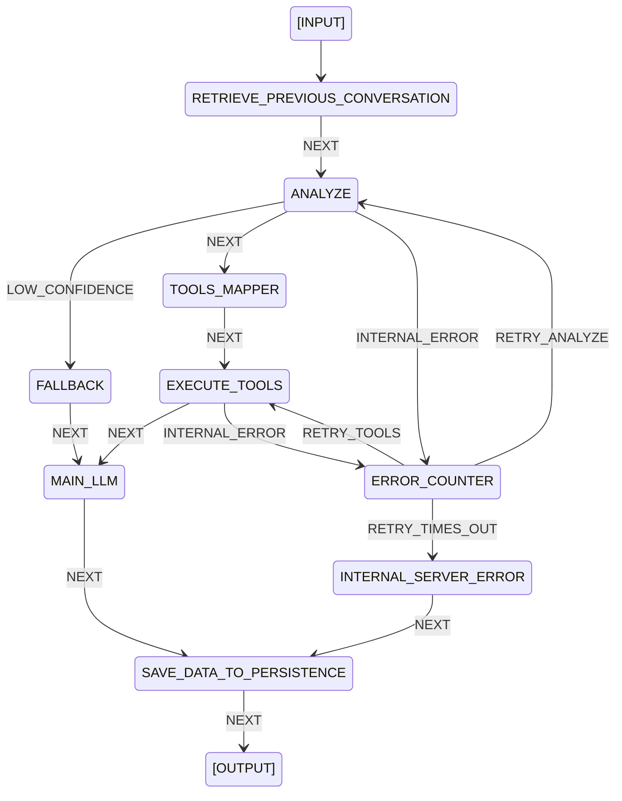

# covalve

A code-based AI pipeline runtime built on Finite State Machine principles.
Gives you full control over your AI pipeline — routing, error handling, and decision making
are defined in code, not in prompts.

---

## Philosophy

Most AI frameworks delegate routing and decision making to LLMs automatically.
covalve takes the opposite approach:

- **Deterministic skeleton** — flow, routing, and error handling are explicit and predictable
- **Probabilistic flesh** — LLMs are only used where reasoning is genuinely needed
- **Schema-driven** — pipeline behavior is defined in a JSON schema, not hardcoded
- **Bring your own infrastructure** — covalve defines the contracts, you bring the implementation

---

## Requirements

- Python 3.10+
- pydantic

Infrastructure dependencies (LLM, cache, database, MCP) are entirely up to your implementation.
covalve only defines the interfaces.

---

## Quickstart

### 1. Implement the infrastructure contracts

covalve requires at minimum an LLM client. Implement the abstract base classes for
whatever your pipeline needs:

```python
from covalve import LLMBase, CacheBase, MemoryStoreBase
from covalve import RuntimeMetadata, MainLLMResponse, GenerateCondition

class MyLLM(LLMBase):
    async def analyze(self, context_payload: str) -> RuntimeMetadata:
        # call any LLM — Gemini, OpenAI, Ollama, etc.
        # must return RuntimeMetadata
        ...

    async def generate(self, context_payload: str, condition: GenerateCondition) -> MainLLMResponse:
        # context_payload contains assembled conversation context
        # condition tells you if this is a clarification or guardrail rejection
        # prepend your own system prompt, then call your LLM
        system_prompt = "You are a helpful assistant."
        full_prompt = f"{system_prompt}\n\n{context_payload}"
        ...
```

### 2. Register your implementations

```python
from covalve import InfrastructureRegistry

deps = InfrastructureRegistry(
    llm=MyLLM(),
    cache=MyCache(),
    memory=MyStorage(),
    tools=MyToolClient(),
    log=MyLogger(),
    guardrail=MyGuardrail()
)
```

### 3. Create and run the pipeline

```python
from covalve import pipeline, base_schema, PipelineConfig

config = PipelineConfig(dependencies=deps)
engine = pipeline(base_schema, config)

result = await engine(query="your question here", session_id="optional-session-id")

print(result.response.text)
print(result.response.status)
```

If `session_id` is not provided, one will be generated automatically.

---

## Built-in Pipeline

covalve ships with a complete conversational AI pipeline for query understanding
and tool-based response generation.



### State descriptions

| State | Description |
|---|---|
| `RETRIEVE_PREVIOUS_CONVERSATION` | Loads conversation history from storage |
| `ANALYZE` | Classifies user query into structured intents |
| `FALLBACK` | Prepares clarification context when confidence is low |
| `TOOLS_MAPPER` | Maps intents to tools based on tools_schema |
| `EXECUTE_TOOLS` | Executes tools in priority order, parallel within same priority |
| `MAIN_LLM` | Synthesizes tool results into a final response |
| `ERROR_COUNTER` | Tracks retry attempts, routes to retry or timeout |
| `INTERNAL_SERVER_ERROR` | Prepares error response when retries are exhausted |
| `SAVE_DATA_TO_PERSISTENCE` | Saves conversation data, cleans up cache keys |

### Intent types

| Intent | Description |
|---|---|
| `explain` | Conceptual questions, definitions, policy explanations |
| `lookup` | Fetch specific data records |
| `operate` | Calculations, aggregations, counts, sums, averages |
| `validate` | Check if something is valid, allowed, or compliant |
| `compare` | Compare two or more entities |
| `source` | Ingest or retrieve data from external sources |

---

## Tools Schema

tools_schema maps intents to tools and controls execution behavior.
Required when your pipeline includes `TOOLS_MAPPER` or `EXECUTE_TOOLS` nodes.

```json
{
    "my_tool": {
        "priority": 1,
        "skippable": true,
        "intent": ["lookup", "operate"]
    },
    "another_tool": {
        "priority": 2,
        "skippable": false,
        "intent": ["explain"]
    }
}
```

| Field | Type | Description |
|---|---|---|
| `priority` | int | Execution order — lower runs first, same priority runs in parallel |
| `skippable` | bool | If `true` and tool fails, pipeline continues. If `false` and tool fails, triggers `INTERNAL_ERROR` |
| `intent` | list[str] | Intents that map to this tool — must contain at least one item |

Pass it via `PipelineConfig`:

```python
import json

with open("tools_schema.json") as f:
    tools_schema = json.load(f)

config = PipelineConfig(
    dependencies=deps,
    tools_schema=tools_schema
)
```

---
## Custom Pipeline

You can replace the built-in schema with your own and register custom handlers.

### Adding a custom handler

```python
from covalve import PipelineConfig, ArgsCtx, ReturnSchema

def factory_my_state(deps):
    async def handle_my_state(ctx: ArgsCtx) -> ReturnSchema:
        copy_context = ctx.context.model_copy(deep=True)
        # your logic here
        return ReturnSchema(event="NEXT", context=copy_context)
    return handle_my_state

config = PipelineConfig(
    dependencies=deps,
    add_handlers={"MY_STATE": factory_my_state}
)
```

### Replacing a built-in handler

```python
config = PipelineConfig(
    dependencies=deps,
    overrides={"ANALYZE": factory_my_custom_analyzer}
)
```

`overrides` replaces an existing built-in handler. `add_handlers` adds a new one —
it raises `ValueError` if the node name conflicts with an existing handler.

---

## Hook System

Hooks let you attach cross-cutting behavior to any node without modifying executor logic.

### Observer — fire and forget

```python
from covalve import hooks, HookOn, ReadOnlyContext

@hooks.observer(nodes=["ANALYZE", "MAIN_LLM"], on=HookOn.EXIT)
async def log_state(ctx: ReadOnlyContext) -> None:
    print(f"state exited, query: {ctx.query}")
```

### Interceptor — blocking, single node

```python
@hooks.interceptor(node="GUARDRAIL", on=HookOn.ENTER, on_false="OUT_OF_SCOPE")
async def check_domain(ctx: ReadOnlyContext) -> bool:
    # return False to redirect to on_false event
    return is_in_scope(ctx.query)
```

`on_false` is required on every interceptor — if you do not need to redirect,
use an observer instead. `on_false` must be a valid transition event defined
in your schema, validated at startup.

---

## Infrastructure Contracts

Implement these abstract base classes to wire covalve to your infrastructure:

| Base class | Responsibility |
|---|---|
| `LLMBase` | Query analysis and response generation |
| `MemoryStoreBase` | Save and retrieve conversation history |
| `CacheBase` | Store retry counters and transient state |
| `ToolClientBase` | Execute tool calls |
| `LogBase` | Receive and store state transition logs |
| `GuardrailBase` | Domain boundary enforcement (optional) |

---

## Output

```python
class OutputSchema(BaseModel):
    text: str
    attachment: Optional[list[AttachmentUnit]]
    status: OutputStatus          # success | error | clarification
    traceId: str
```

---

## License

MIT